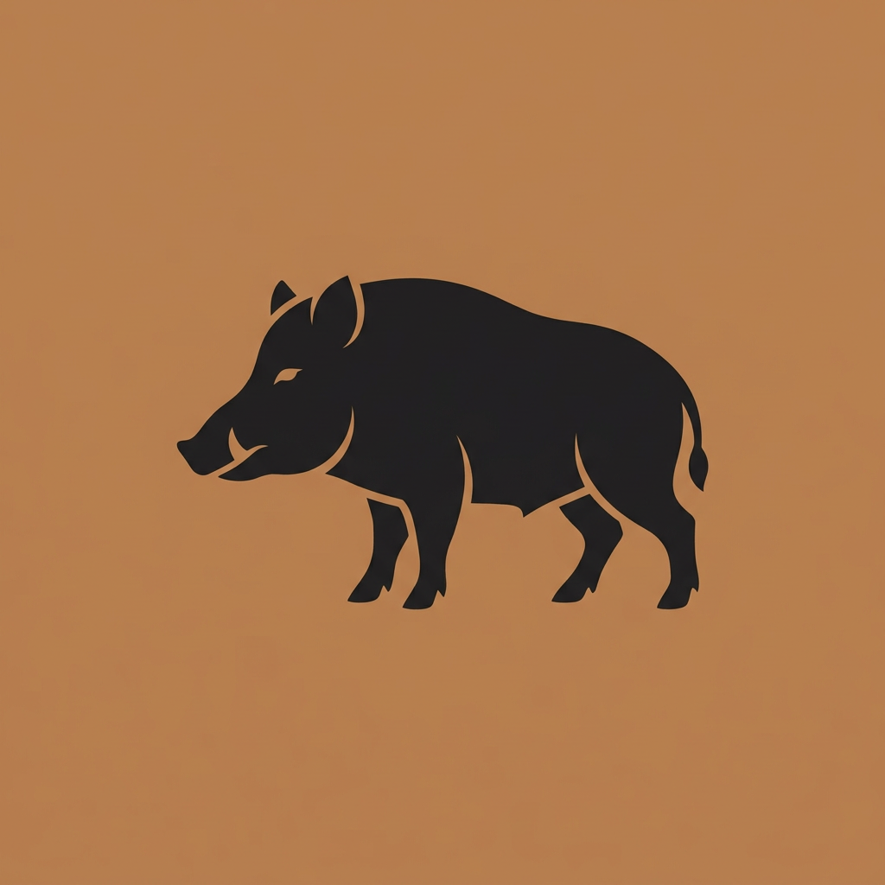
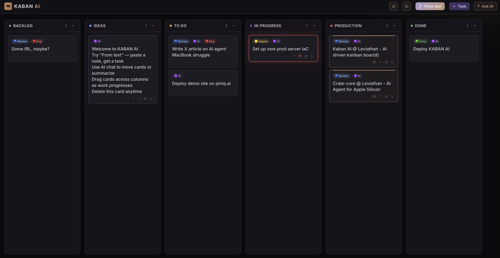

<div align="center">

<h1 align="center" style="border: none; margin: 0.6em 0;">
  <span style="display: inline-flex; align-items: center; gap: 0.35em;">
    <span>KABAN AI</span>
    
  </span>
</h1>

**Personal Kanban board with a built-in LLM agent** — paste messy text, get a structured task. Runs on Ollama locally or any OpenAI-compatible API.

<p>
  <a href="https://github.com/cha0skvlt/kaban.ai/actions/workflows/ci.yml"></a>
  <a href="LICENSE"></a>
  
  
  
  
  
  
</p>



</div>

---

## Table of contents

- [Highlights](#highlights)
- [Key feature: task from text](#key-feature-task-from-text)
- [Stack](#stack)
- [Quick start](#quick-start)
- [Environment](#environment)
- [API](#api)
- [Docker](#docker)
- [Auto-start (daemon)](#auto-start-daemon)
- [Development](#development)
- [Design tokens (UI)](#design-tokens-ui)
- [Limitations](#limitations)
- [Project layout](#project-layout)
- [License](#license)

---

## Highlights

| | |
|---|---|
| **From text** | Paste a note, chat log, or brain dump → one card with title, column, labels, description |
| **Ask AI** | Read-only board Q&A (summaries, column contents) — no accidental mutations from chips |
| **Local-first** | Single-page UI, no frontend build step, Postgres-backed persistence |
| **LLM-flexible** | Ollama on the host, or OpenAI / OpenRouter / Groq via env |
| **Ship-ready** | Docker + Nginx on `:8080`, API key on `/api/*` |
| **Quality bar** | **130+ tests**, **100%** line + branch coverage on backend, **Black** + **Ruff** |

---

## Key feature: task from text

The **From text** button (or `POST /api/agent/from-text`) turns a copy-pasted blob into one board card:

| Field | Behavior |
|-------|----------|
| **Title** | Short, verb-first summary (not the raw paste) |
| **Column** | Inferred (`ideas`, `todo`, `production`, …) |
| **Labels** | `orange` urgent, `red` bug, `purple` AI, `blue` docs, etc. |
| **Description** | Optional cleaned context |

**Flow:** LLM JSON → server validation → heuristic merge (labels / column / title) → local regex fallback if the model fails.

<details>
<summary><b>Example request</b> (curl)</summary>

```bash
curl -s http://localhost:8080/api/agent/from-text \
  -H "Content-Type: application/json" \
  -H "X-API-Key: dev-key" \
  -d '{
    "raw_text": "urgently fix 500 on prod when deploying crate-core, logs in slack",
    "board_state": { "columns": [...], "cards": [...] }
  }'
```

</details>

<details>
<summary><b>Example response</b></summary>

```json
{
  "actions": [{
    "type": "add_task",
    "title": "Fix 500 on crate-core deploy",
    "target_column": "todo",
    "labels": ["orange", "red"],
    "desc": "..."
  }],
  "message": "Task added to To Do"
}
```

</details>

---

## Stack

| Layer | Technology |
|-------|------------|
| UI | `frontend/kanban.html` + native ES modules in `frontend/js/` (no bundler) |
| API | [FastAPI](https://fastapi.tiangolo.com/) + httpx |
| Storage | PostgreSQL 16 (Docker Compose) |
| LLM | OpenAI-compatible chat completions |
| Deploy | Docker Compose — Nginx `:8080` + Python backend |

---

## Quick start

**Prerequisites:** [Docker](https://docs.docker.com/) (Docker Desktop, OrbStack, or Linux engine) and [Ollama](https://ollama.com/) on the host (for local LLM mode), or an external OpenAI-compatible API in `.env`.

```bash
git clone https://github.com/cha0skvlt/kaban.ai.git
cd kaban.ai
cp .env.example .env
make setup
ollama pull qwen2.5-coder:32b   # if using local Ollama
make start
open http://localhost:8080
```

**Auto-start at boot / login:**

```bash
make install-daemon
```

Board data lives in the Docker volume `kaban-postgres-data`.

### Backup / restore

- **Backup**: `make backup` (uses `pg_dump | gzip`)
- **Restore**: `gunzip -c backup/<file>.sql.gz | psql "$DATABASE_URL"`

### Migrate from JSON (v1.x)

If you have an old `board_store.json` from the JSON-storage versions, you can import it once:

```bash
cp .env.example .env
docker compose up -d postgres
make migrate
python3 scripts/import_json_to_pg.py
```

The script renames the JSON file to `*.bak.<timestamp>` after a successful import.

---

## Environment

Copy `.env.example` → `.env`.

### Local Ollama (default)

```env
OPENAI_BASE_URL=http://host.docker.internal:11434/v1
OPENAI_API_KEY=ollama
OPENAI_MODEL=qwen2.5-coder:32b
KANBAN_API_KEY=dev-key
```

### External API

Set `OPENAI_BASE_URL`, `OPENAI_API_KEY`, and `OPENAI_MODEL` to your provider (OpenAI, OpenRouter, Groq, …).

| Variable | Purpose |
|----------|---------|
| `OPENAI_*` | LLM endpoint and model |
| `KANBAN_API_KEY` | Required on `/api/*` except health (`X-API-Key` header) |

The UI sends `X-API-Key: dev-key` by default. Override in the browser:

```js
localStorage.setItem('kanban_api_key', 'your-key')
```

---

## API

| Method | Path | Auth | Purpose |
|--------|------|:----:|---------|
| `GET` | `/api/health` | — | Liveness |
| `GET` | `/api/board` | key | Load board state |
| `GET` | `/api/cards/{id}` | key | Fetch one card (realtime sync) |
| `POST` | `/api/cards` | key | Create card |
| `PATCH` | `/api/cards/{id}` | key | Update card |
| `POST` | `/api/cards/{id}/move` | key | Move card |
| `DELETE` | `/api/cards/{id}` | key | Delete card |
| `GET` | `/api/columns` | key | List columns |
| `POST` | `/api/columns` | key | Create column |
| `PUT` | `/api/labels` | key | Replace label catalog |
| `POST` | `/api/agent` | key | Natural-language commands |
| `POST` | `/api/agent/from-text` | key | **Paste → task** (main feature) |

**Agent contract:** mutations as typed `actions` (`add_task`, `move_task`, …); read-only answers in `message`. JSON is validated on the server with one LLM retry, then regex fallback. No LangChain.

---

## Docker

Single compose file — builds locally; mounts `frontend/kanban.html`, `frontend/css/`, and `frontend/js/` for live UI edits (no bundler).

```bash
make start     # build + start (Ollama checks, detached)
make logs      # follow logs
make stop      # stop stack
make restart   # rebuild + restart
```

| Note | Detail |
|------|--------|
| Proxy | Nginx serves the UI and forwards `/api/*` to FastAPI |
| Ollama | Runs on the **host**; containers use `host.docker.internal` (Mac/Windows native; Linux via `host-gateway` in compose) |
| Data | Postgres volume `kaban-postgres-data`; run `make migrate` after first start |

---

## Auto-start (daemon)

`make install-daemon` registers **kaban.ai** to start after **boot** (Linux) or **login** (macOS). It waits for Docker, starts Ollama when configured, then runs `docker compose up -d`.

On macOS the background item appears as **kaban.ai** in Login Items (unsigned script — “unidentified developer” is normal without Apple code signing).

```bash
make install-daemon
```

| OS | Mechanism | When it runs |
|----|-----------|--------------|
| **Linux** | systemd user unit `kaban.service` | After Docker starts |
| **macOS** | LaunchAgent `ai.kaban.ai` | At user login |

**Linux — start at boot without logging in:**

```bash
loginctl enable-linger "$USER"
```

**System-wide on Linux** (optional, requires sudo):

```bash
./scripts/install-daemon.sh --system
```

**Useful commands:**

```bash
make daemon-status
make uninstall-daemon

# Linux (user)
systemctl --user status kaban
systemctl --user restart kaban
journalctl --user -u kaban -f

# macOS
launchctl print gui/$(id -u)/ai.kaban.ai
launchctl kickstart -k gui/$(id -u)/ai.kaban.ai
```

Logs: `logs/kaban.ai.log` (and `logs/kaban.ai.out.log` on macOS).

---

## Development

```bash
make setup          # pip install deps + .env
make dev            # uvicorn on :8000 (no Docker)
make test           # pytest
make test-cov       # pytest + 100% coverage gate
make lint           # ruff + black --check
make format         # black + ruff --fix
```

### Code quality

All Python (`backend/`, `test/`) uses:

- **[Black](https://black.readthedocs.io/)** — formatting (`line-length = 100`, `pyproject.toml`)
- **[Ruff](https://docs.astral.sh/ruff/)** — lint (pycodestyle, pyflakes, import order, bugbear, pyupgrade)

```bash
make lint       # must pass before merge / push
make test-cov   # 137 tests, 100% coverage gate
make format     # auto-fix
```

Run **`make lint`** and **`make test-cov`** before every push (same checks as [CI](.github/workflows/ci.yml) on `main`).

### Tests

**130+ tests**, **100% line and branch coverage** on `backend/app.py`, `backend/store.py`, `backend/agent.py`:

```bash
make test-cov
```

---

## Design tokens (UI)

Single palette in `frontend/css/tokens.css` (`:root` + two themes). Avoid one-off hex in components.

| Token | Hex | Use |
|-------|-----|-----|
| `p-neutral` | `#888690` | Backlog column |
| `p-blue` | `#58a6ff` | Ideas column, Review labels |
| `p-amber` | `#e3b341` | To Do column, Urgent labels |
| `p-purple` | `#6750a4` | Accent, In Progress, AI labels |
| `p-red` | `#f85149` | Production, Bug labels |
| `p-green` | `#3fb950` | Done labels |
| `p-bronze` | `#b8845a` | KABAN brand, Ask AI, header tools |

Themes (`data-theme="dark"` / `light`) remap surfaces, text, shadows, and `color-mix` derivatives. Backend column defaults mirror `COLOR_PALETTE` in `backend/store.py`.

---

## Limitations

- Single shared API key — not multi-user auth
- AI quality depends on the model; invalid JSON triggers retry + local fallback
- Board UI works offline for manual edits; AI needs the backend
- WebSocket sync reloads changed entities (not a full operational-transform editor)

---

## Project layout

```
.github/workflows/      # CI
docker/Dockerfile.nginx
img/                    # logos, favicons, kaban.png, demo.png (README screenshot)
frontend/kanban.html    # UI shell (HTML + inline handlers)
frontend/css/           # tokens, components, overlays, responsive
frontend/js/            # ES modules (state, api, board UI, AI)
backend/app.py          # FastAPI routes
backend/agent.py        # LLM + validation + from-text logic
backend/store.py        # Postgres persistence (psycopg3)
backend/realtime.py     # LISTEN/NOTIFY → WebSocket hub
backend/alembic/        # database migrations
scripts/kaban.ai        # daemon entry (auto-start)
test/                   # pytest suite
docker-compose.yml
CHANGELOG.md
VERSION
Makefile
pyproject.toml          # Black + Ruff config
LICENSE                 # GNU GPL v3
```

---

## License

Copyright © 2026 Eugene Tomashkov

This project is licensed under the **GNU General Public License v3.0** — see [LICENSE](LICENSE).

You are free to use, modify, and distribute this software under the terms of the GPL v3. Source files include the standard GPL v3 notice in their headers.
