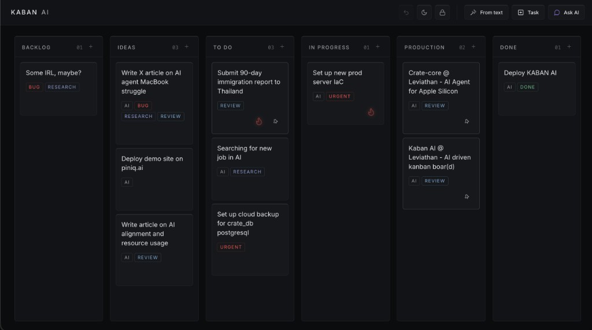
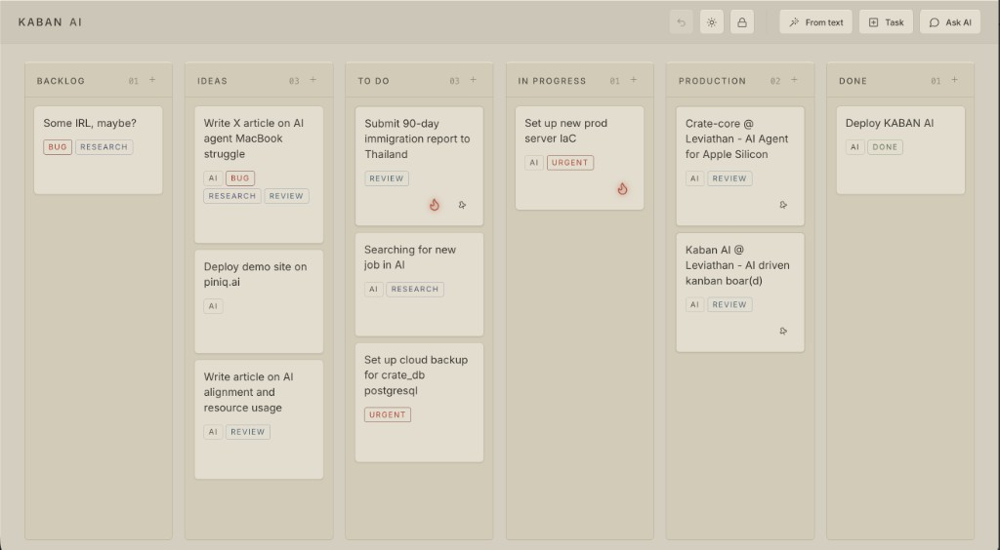

<div align="center">

<h1 align="center" style="border: none; margin: 0.6em 0;">STIGMER AI</h1>

**Kanban board + LLM assistant in the browser, with a Postgres-backed multi-agent coordination layer for external swarms.**

<p>
  <a href="https://github.com/cha0skvlt/stigmer.ai/actions/workflows/ci.yml"></a>
  <a href="LICENSE"></a>
  
  
  
  
  
  
</p>

<p>
  
  
</p>
<p><b>night</b> (default, graphite) · <b>day</b> (sepia light)</p>

<p><sub><b>STIGMER</b> — from <em>stigmergy</em> (Grassé): coordination through traces left on a shared surface, not direct agent-to-agent messaging. This product is that surface—a Kanban board where humans and interchangeable agents coordinate only via cards, claims, leases, and versioned edits; the environment holds the intelligence, not a chat between bots. The name also nods to Stirner’s <em>union of egoists</em>: each actor pursues its own ends on common ground, without a central master orchestrating the swarm.</sub></p>

</div>

---

## Project overview

STIGMER AI is a **single-page Kanban application** (version `1.2`, GPL-3.0) aimed at one primary workflow: capture messy input, structure it as cards on a six-column board, and collaborate with a built-in LLM without leaving the UI. Persistence is **PostgreSQL**; there is no frontend build step (vanilla ES modules + CSS design tokens).

The codebase actually ships **two agent models**, and they should not be conflated:

| Layer | Who uses it | What it does |
|-------|-------------|--------------|
| **Browser product** | Human via `X-API-Key` (`STIGMER_API_KEY`) | Kanban CRUD, drag-and-drop, pin/flame labels, theme toggle, WebSocket sync, **From text** and **Ask AI** |
| **Stigmergy API** | External processes via `X-Agent-Key` (per-agent bcrypt keys) or the human key on task routes | Atomic **claim / heartbeat / complete / release**, optimistic locking (`version`), audit log — **not wired into the web UI** |

In other words: the portfolio UI in the screenshots is the **human-facing board**. The swarm layer is a **real, tested HTTP + SQL contract** (`/api/tasks/*`, `docs/AGENTS.md`, `backend/agent_tools.json`) for interchangeable agents that coordinate only through board state — no agent-to-agent channel.

### Built-in LLM (browser)

- Endpoints: `POST /api/agent`, `POST /api/agent/from-text`.
- The server returns validated JSON (`actions` + `message`). **Mutations are executed in the browser**: `frontend/js/ai.js` maps actions to `POST/PATCH/DELETE` on `/api/cards/*`.
- Supported action types: `add_task`, `move_task`, `update_task`, `delete_task`, plus read-only `comment` and `summarize_board`.
- Fallback: regex/heuristics if the model returns invalid JSON (one retry, then local fallback). Commands are logged in `agent_history`.

### Stigmergy (backend + CLI)

- Task lease TTL from `STIGMERGY_LEASE_TTL_SEC` (default 300s). Stale leases are reclaimed on the next claim attempt (lazy, no sweeper).
- Conflict responses use machine-readable `409` bodies: `already_claimed`, `lease_lost`, `not_holder`, `version_conflict`.
- `make agent-add` / `agent-list` / `agent-revoke` manage credentials; raw keys are shown once, only **bcrypt hashes** are stored.
- `agent_events` records claim/release/complete for registered agents; inserts fire `board.changed` NOTIFY (UI activity feed not implemented yet).

### UI vs backend (honest boundary)

| Capability | In browser UI | In API / store only |
|------------|:-------------:|:-------------------:|
| Card/column CRUD | Yes | — |
| From text / Ask AI | Yes | — |
| `claimed_by`, lease, `version` on cards | Data may arrive over the wire; **not displayed or edited** | Yes |
| `/api/tasks/*` claim loop | No | Yes |
| `X-Agent-Key` | No | Yes |
| Optimistic `PATCH` with `version` | No (patches omit `version`) | Yes |

WebSocket (`/ws/board?api_key=…`) listens to Postgres `NOTIFY` and reloads changed cards/columns/labels — not operational-transform editing.

---

## Technical architecture

### Runtime stack

| Layer | Technology | Notes |
|-------|------------|--------|
| UI shell | `frontend/kanban.html` | Inline bootstrapping, no React/Vue/Svelte |
| UI logic | `frontend/js/*.js` (14 modules) | `api.js`, `cards.js`, `persist.js`, `realtime.js`, `ai.js`, … |
| Styling | `frontend/css/tokens.css` + components | Design tokens only; `make lint` blocks raw hex outside `tokens.css` |
| Themes | `data-theme` + `localStorage` (`stigmer-theme`) | **night** (default), **day** (NieR-inspired sepia) |
| API | Python 3.12 (CI), FastAPI, uvicorn | `backend/app.py` |
| DB access | psycopg3 + connection pool | `backend/store.py` |
| Migrations | Alembic (4 revisions) | Through `004_stigmergy_agents` |
| LLM client | httpx → OpenAI-compatible `/v1/chat/completions` | Ollama on host or remote provider |
| Realtime | `backend/realtime.py` | `LISTEN board.changed` → WebSocket broadcast |
| Deploy | Docker Compose | `postgres`, `backend`, nginx on **:8080** |
| Quality | pytest, Ruff, Black | **202 tests**, **100%** line+branch coverage on `backend/*` only |

### Database schema (Alembic)

| Revision | Adds |
|----------|------|
| `001_initial` | `columns`, `cards`, `labels`, `card_labels`, `agent_history`, NOTIFY triggers on board tables |
| `002_label_tone_colors` | Extended default label tones |
| `003_stigmergy_concurrency` | On `cards`: `version`, `claimed_by`, `claimed_at`, `lease_expires_at`, index `idx_cards_claimable` |
| `004_stigmergy_agents` | `agents`, `agent_events`, NOTIFY on `agent_events` |

Default columns (slugs): `backlog`, `ideas`, `todo`, `inprogress`, `production`, `done`. Default label slugs include `red`, `orange`, `purple`, `blue`, `green`.

### Backend modules (responsibilities)

| Module | Responsibility |
|--------|----------------|
| `app.py` | HTTP routes, Pydantic request models |
| `store.py` | All SQL: board load/save paths, card CRUD, atomic stigmergy ops (`RETURNING`), optimistic updates |
| `agent.py` | LLM prompts, JSON validation, from-text heuristics |
| `agent_registry.py` | Agent CRUD, bcrypt via passlib, `last_seen_at` |
| `board_auth.py` | `X-API-Key` → `human`; `X-Agent-Key` → `agent_id` |
| `task_api.py` | Maps domain errors to HTTP 409 JSON |
| `task_errors.py` | `AlreadyClaimedError`, `LeaseLostError`, `NotTaskHolderError`, `VersionConflictError` |
| `agent_tools.json` | OpenAI-style tool definitions for **external** agents (not bound to `/api/agent`) |
| `realtime.py` | WebSocket hub |

`POST /api/board` (bulk replace) intentionally returns **410** — clients must use granular card/column endpoints.

### Authentication model

- **Human / UI:** header `X-API-Key` must match `STIGMER_API_KEY` on `/api/board`, `/api/cards/*`, `/api/columns`, `/api/labels`, `/api/agent*`.
- **Swarm:** header `X-Agent-Key` resolved against `agents.key_hash`; unknown key → **401**; success bumps `last_seen_at`.
- **Task routes** accept either header. With the human key, `claimed_by` is the reserved id `human`. Body field `agent_id` is **ignored** (spoof-resistant).

### External agent tool surface

`GET /api/agent/tools` returns `backend/agent_tools.json` (six functions: `list_available_tasks`, `claim_task`, `heartbeat_task`, `complete_task`, `release_task`, `post_trace` where the last maps to `POST /api/cards`). Full loop and error semantics: **[docs/AGENTS.md](docs/AGENTS.md)**.

---

## Table of contents

- [Project overview](#project-overview)
- [Technical architecture](#technical-architecture)
- [Highlights](#highlights)
- [Key feature: task from text](#key-feature-task-from-text)
- [Stack](#stack)
- [Quick start](#quick-start)
- [Environment](#environment)
- [API](#api)
- [Docker](#docker)
- [Auto-start (daemon)](#auto-start-daemon)
- [Development](#development)
- [Multi-agent (stigmergy)](#multi-agent-stigmergy)
- [Design tokens (UI)](#design-tokens-ui)
- [Limitations](#limitations)
- [Project layout](#project-layout)
- [License](#license)

---

## Highlights

| | |
|---|---|
| **From text** | Paste a note, chat log, or brain dump → one card with title, column, labels, description |
| **Ask AI** | Read-only board Q&A (summaries, column contents) — no accidental mutations from chips |
| **Local-first** | Single-page UI, no frontend build step, Postgres-backed persistence |
| **LLM-flexible** | Ollama on the host, or OpenAI / OpenRouter / Groq via env |
| **Ship-ready** | Docker + Nginx on `:8080`, API key on `/api/*` |
| **Swarm-ready** | Per-agent API keys, leases, optimistic locking — shared board as stigmergic environment |
| **Quality bar** | **202 tests**, **100%** line + branch coverage on backend, **Black** + **Ruff** |

---

## Key feature: task from text

The **From text** button (or `POST /api/agent/from-text`) turns a copy-pasted blob into one board card:

| Field | Behavior |
|-------|----------|
| **Title** | Short, verb-first summary (not the raw paste) |
| **Column** | Inferred (`ideas`, `todo`, `production`, …) |
| **Labels** | `orange` urgent, `red` bug, `purple` AI, `blue` docs, etc. |
| **Description** | Optional cleaned context |

**Flow:** LLM JSON → server validation → heuristic merge (labels / column / title) → local regex fallback if the model fails.

<details>
<summary><b>Example request</b> (curl)</summary>

```bash
curl -s http://localhost:8080/api/agent/from-text \
  -H "Content-Type: application/json" \
  -H "X-API-Key: dev-key" \
  -d '{
    "raw_text": "urgently fix 500 on prod when deploying crate-core, logs in slack",
    "board_state": { "columns": [...], "cards": [...] }
  }'
```

</details>

<details>
<summary><b>Example response</b></summary>

```json
{
  "actions": [{
    "type": "add_task",
    "title": "Fix 500 on crate-core deploy",
    "target_column": "todo",
    "labels": ["orange", "red"],
    "desc": "..."
  }],
  "message": "Task added to To Do"
}
```

</details>

---

## Stack

Summary table — see [Technical architecture](#technical-architecture) for module-level detail.

| Layer | Technology |
|-------|------------|
| UI | `frontend/kanban.html` + native ES modules in `frontend/js/` (no bundler) |
| API | [FastAPI](https://fastapi.tiangolo.com/) + httpx |
| Storage | PostgreSQL 16 (Docker Compose) |
| LLM | OpenAI-compatible chat completions |
| Deploy | Docker Compose — Nginx `:8080` + Python backend |

---

## Quick start

**Prerequisites:** [Docker](https://docs.docker.com/) (Docker Desktop, OrbStack, or Linux engine) and [Ollama](https://ollama.com/) on the host (for local LLM mode), or an external OpenAI-compatible API in `.env`.

```bash
git clone https://github.com/cha0skvlt/stigmer.ai.git
cd stigmer.ai
cp .env.example .env
make setup
ollama pull qwen2.5-coder:32b   # if using local Ollama
make start
open http://localhost:8080
```

**Auto-start at boot / login:**

```bash
make install-daemon
```

Board data lives in the Docker volume `stigmer-postgres-data`.

### Backup / restore

- **Backup**: `make backup` (uses `pg_dump | gzip`)
- **Restore**: `gunzip -c backup/<file>.sql.gz | psql "$DATABASE_URL"`

### Migrate from JSON (v1.x)

If you have an old `board_store.json` from the JSON-storage versions, you can import it once:

```bash
cp .env.example .env
docker compose up -d postgres
make migrate
python3 scripts/import_json_to_pg.py
```

The script renames the JSON file to `*.bak.<timestamp>` after a successful import.

---

## Environment

Copy `.env.example` → `.env`.

### Local Ollama (default)

```env
OPENAI_BASE_URL=http://host.docker.internal:11434/v1
OPENAI_API_KEY=ollama
OPENAI_MODEL=qwen2.5-coder:32b
STIGMER_API_KEY=dev-key
```

### External API

Set `OPENAI_BASE_URL`, `OPENAI_API_KEY`, and `OPENAI_MODEL` to your provider (OpenAI, OpenRouter, Groq, …).

| Variable | Purpose |
|----------|---------|
| `OPENAI_*` | LLM endpoint and model |
| `STIGMER_API_KEY` | Human/UI key on legacy routes (`X-API-Key` header) |
| `STIGMERGY_LEASE_TTL_SEC` | Task-claim lease TTL in seconds (default `300`) |

The UI sends `X-API-Key: dev-key` by default. Override in the browser:

```js
localStorage.setItem('stigmer_api_key', 'your-key')
```

---

## API

| Method | Path | Auth | Purpose |
|--------|------|:----:|---------|
| `GET` | `/api/health` | — | Liveness |
| `GET` | `/api/board` | key | Load board state |
| `GET` | `/api/cards/{id}` | key | Fetch one card (realtime sync) |
| `POST` | `/api/cards` | key | Create card |
| `PATCH` | `/api/cards/{id}` | key | Update card |
| `POST` | `/api/cards/{id}/move` | key | Move card |
| `DELETE` | `/api/cards/{id}` | key | Delete card |
| `GET` | `/api/columns` | key | List columns |
| `POST` | `/api/columns` | key | Create column |
| `PUT` | `/api/labels` | key | Replace label catalog |
| `POST` | `/api/agent` | key | Natural-language commands |
| `POST` | `/api/agent/from-text` | key | **Paste → task** (main feature) |
| `GET` | `/api/tasks/available` | key or agent | List claimable tasks (`?column=`, `?label=`) |
| `POST` | `/api/tasks/{id}/claim` | key or agent | Claim task (lease) |
| `POST` | `/api/tasks/{id}/heartbeat` | key or agent | Renew lease |
| `POST` | `/api/tasks/{id}/complete` | key or agent | Finish + release |
| `POST` | `/api/tasks/{id}/release` | key or agent | Release unfinished task |
| `GET` | `/api/agent/tools` | key | LLM tool definitions (JSON Schema) |

**LLM board agent:** mutations as typed `actions` (`add_task`, `move_task`, …); read-only answers in `message`. JSON is validated on the server with one LLM retry, then regex fallback. No LangChain.

**Swarm agents:** use `X-Agent-Key` (per-agent credential from `make agent-add`). Task routes also accept the human `X-API-Key` (identity `human`). See [Multi-agent (stigmergy)](#multi-agent-stigmergy) and [docs/AGENTS.md](docs/AGENTS.md).

---

## Docker

Single compose file — builds locally; mounts `frontend/kanban.html`, `frontend/css/`, and `frontend/js/` for live UI edits (no bundler).

```bash
make start     # build + start (Ollama checks, detached)
make logs      # follow logs
make stop      # stop stack
make restart   # rebuild + restart
```

| Note | Detail |
|------|--------|
| Proxy | Nginx serves the UI and forwards `/api/*` to FastAPI |
| Ollama | Runs on the **host**; containers use `host.docker.internal` (Mac/Windows native; Linux via `host-gateway` in compose) |
| Data | Postgres volume `stigmer-postgres-data`; run `make migrate` after first start |

---

## Auto-start (daemon)

`make install-daemon` registers **stigmer.ai** to start after **boot** (Linux) or **login** (macOS). It waits for Docker, starts Ollama when configured, then runs `docker compose up -d`.

On macOS the background item appears as **stigmer.ai** in Login Items (unsigned script — “unidentified developer” is normal without Apple code signing).

```bash
make install-daemon
```

| OS | Mechanism | When it runs |
|----|-----------|--------------|
| **Linux** | systemd user unit `stigmer.service` | After Docker starts |
| **macOS** | LaunchAgent `ai.stigmer` | At user login |

**Linux — start at boot without logging in:**

```bash
loginctl enable-linger "$USER"
```

**System-wide on Linux** (optional, requires sudo):

```bash
./scripts/install-daemon.sh --system
```

**Useful commands:**

```bash
make daemon-status
make uninstall-daemon

# Linux (user)
systemctl --user status stigmer
systemctl --user restart stigmer
journalctl --user -u stigmer -f

# macOS
launchctl print gui/$(id -u)/ai.stigmer
launchctl kickstart -k gui/$(id -u)/ai.stigmer
```

Logs: `logs/stigmer.log` (and `logs/stigmer.out.log` on macOS).

**Fresh Postgres (v1.2+):** role/db/volume are `stigmer` / `stigmer-postgres-data`. To wipe and reseed: `make reset-db`, then `make migrate && make start`. Update `.env` `DATABASE_URL` and `STIGMER_API_KEY`; in the browser set `localStorage.setItem('stigmer_api_key', '…')`. To keep old tasks, `make backup` before reset, then restore with `psql` after migrate.

---

## Development

```bash
make setup          # pip install deps + .env
make dev            # uvicorn on :8000 (no Docker)
make test           # pytest
make test-cov       # pytest + 100% coverage gate
make lint           # ruff + black --check
make format         # black + ruff --fix
```

### Code quality

All Python (`backend/`, `test/`) uses:

- **[Black](https://black.readthedocs.io/)** — formatting (`line-length = 100`, `pyproject.toml`)
- **[Ruff](https://docs.astral.sh/ruff/)** — lint (pycodestyle, pyflakes, import order, bugbear, pyupgrade)

```bash
make lint       # must pass before merge / push
make test-cov   # 202 tests, 100% coverage gate
make format     # auto-fix
```

Run **`make lint`** and **`make test-cov`** before every push (same checks as [CI](.github/workflows/ci.yml) on `main`).

### Tests

**202 tests**, **100% line and branch coverage** on backend (`app`, `store`, `agent`, `agent_registry`, `board_auth`, `task_api`, `agent_tools`, …):

```bash
make test-cov
```

---

## Multi-agent (stigmergy)

STIGMER AI is not only a single-user board: it is a **shared environment** where interchangeable agents coordinate through traces on the same surface — claims, leases, and versioned edits — without talking to each other directly. That indirection is the architecture: the board is the system.

| Identity | Header | Used for |
|----------|--------|----------|
| Human / UI | `X-API-Key` (`STIGMER_API_KEY`) | `claimed_by = human`, all legacy `/api/board`, `/api/cards`, … |
| Swarm agent | `X-Agent-Key` (per-agent secret) | `/api/tasks/*`, authenticated `agent_id` on claims |

**Credential lifecycle**

```bash
make agent-add ID=leviathan-coder NAME="Leviathan coder"   # prints key once (bcrypt hash stored)
make agent-list
make agent-revoke ID=leviathan-coder                      # key dead immediately; releases its claims
```

Raw keys are never stored or logged — only `key_hash` in Postgres (`agents` table).

**Agent loop** (claim → work → heartbeat → complete/release → optional `post_trace`):

1. `GET /api/tasks/available` — pick a free task (or stale lease).
2. `POST /api/tasks/{id}/claim` — if `already_claimed`, pick another (never retry the same id).
3. `POST /api/tasks/{id}/heartbeat` before lease expiry; on `lease_lost`, stop.
4. `PATCH /api/cards/{id}` with `version` for edits; on `version_conflict`, re-read.
5. `POST /api/tasks/{id}/complete` or `release`.
6. `POST /api/cards` to leave a new trace for later.

Full HTTP contract, 409 error codes, and LLM tool definitions: **[docs/AGENTS.md](docs/AGENTS.md)** and `backend/agent_tools.json` (`GET /api/agent/tools`).

Claim/release/complete events append to `agent_events` (audit log) and fire `board.changed` NOTIFY for a future live activity feed.

The single-user UI is unchanged: one `STIGMER_API_KEY` in the browser, no agent setup required.

---

## Design tokens (UI)

Industrial UI per the **cha0skvlt** design system (external guidebook). **Runtime source of truth:** `frontend/css/tokens.css` — all palette values and scales. `components.css`, `overlays.css`, and `responsive.css` use `var(--token)` only (enforced in `make lint`).

- **night (default):** cold graphite, purple `--accent`, edge-light depth — see `img/night.png`.
- **day:** NieR sepia paper (`--bg` `#d4cebf`, cards `#e3ddce`), sepia inversion accent — see `img/day.png`.
- **Structure:** monochrome column headers; colour only on label pills, `--signal` (flame / urgent), and interactive accent. Theme persists via `localStorage` (`stigmer-theme`).

Icons: Lucide inline SVG in `frontend/js/icons.js` (`stroke-width` 1.75, `currentColor`).

---

## Limitations

- Swarm auth is API-key based (not OAuth or RBAC); one key per agent
- AI quality depends on the model; invalid JSON triggers retry + local fallback
- Board UI works offline for manual edits; AI needs the backend
- WebSocket sync reloads changed entities (not a full operational-transform editor)

---

## Project layout

```
.github/workflows/      # CI
docker/Dockerfile.nginx
img/                    # logos, favicons, night.png, day.png (README screenshots)
frontend/kanban.html    # UI shell (HTML + inline handlers)
frontend/css/           # tokens, components, overlays, responsive
frontend/js/            # ES modules (state, api, board UI, AI)
backend/app.py          # FastAPI routes
backend/agent.py        # LLM + validation + from-text logic
backend/store.py        # Postgres persistence (psycopg3)
backend/agent_registry.py  # per-agent keys (bcrypt), last_seen
backend/board_auth.py   # X-API-Key (human) + X-Agent-Key resolution
backend/task_api.py     # stigmergy HTTP error mapping
backend/agent_tools.json   # LLM tool spec for swarm agents
backend/realtime.py     # LISTEN/NOTIFY → WebSocket hub
backend/alembic/        # database migrations
docs/AGENTS.md          # swarm agent contract
scripts/agents_cli.py   # make agent-add/list/revoke
scripts/stigmer           # daemon entry (auto-start)
test/                   # pytest suite
docker-compose.yml
CHANGELOG.md
VERSION
Makefile
pyproject.toml          # Black + Ruff config
LICENSE                 # GNU GPL v3
```

---

## License

Copyright © 2026 Eugene Tomashkov

This project is licensed under the **GNU General Public License v3.0** — see [LICENSE](LICENSE).

You are free to use, modify, and distribute this software under the terms of the GPL v3. Source files include the standard GPL v3 notice in their headers.
